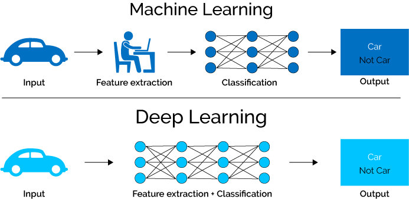
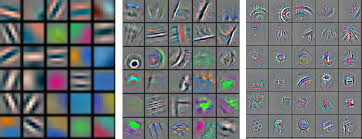
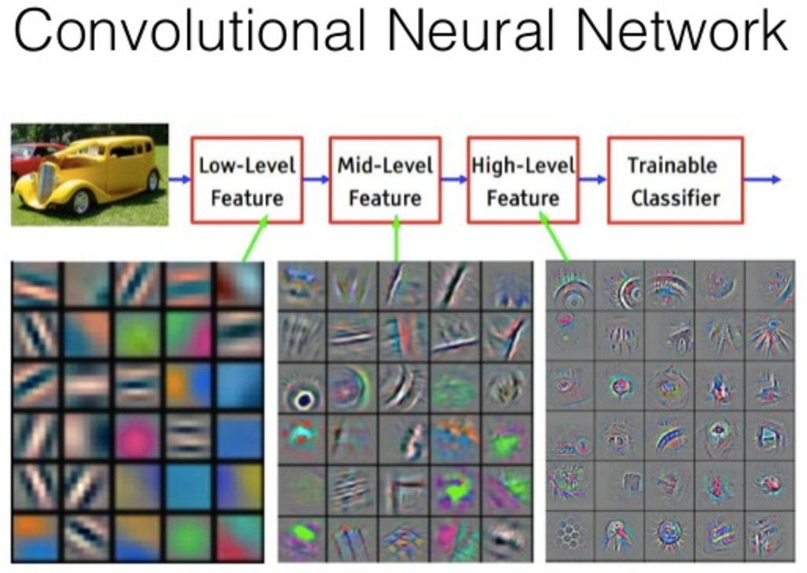

# Day 2 - Neural Networks

## A brief overview of deep neural networks

### Neural Networks

* Inputs, activation (sigmoid, ReLU), output(s).
>__Use material from:__
>https://jalammar.github.io/visual-interactive-guide-basics-neural-networks/
>
* Feedforward. Prediction error, cost function.
>__Use material from:__
>https://jalammar.github.io/feedforward-neural-networks-visual-interactive/
>
* Training: Optimization, gradient descent. Backpropagation.
>__Use existing material__

### Deep NNs - the origins:

* Images, audio, words: Levels of representation. Manual feature engineering.
> Machine learning models learn a relation (mapping, function) between some input variables (features, X) and an output variable (target, y): 

	y = f(X) 

> For example, we can imagine there's a clear relationship between the sq.foot area of a house and its price. ML models successfully approximate this relation through training on available samples.

> But when it comes to image, audio, and natural language text data, the relation between input features and the target variable is very far removed.

__<Find illustrations of idea: pixel values in image vs. identity of face, or facial expression, etc.>__

> A single pixel, or a single sound sample is virtually meaningless by itself when discerning the meaning of an image or audio. Instead, people have been developing *higher level* or *mid-level* features, more meaningful than single pixels, sound samples, or letters. For images, people used to develop detectors (filters) for edges, corners, basic shapes, etc. in the image. Then combination of these basic elements make more complex image elements, so on and so forth. A lot of effort went into designing these mid-level features that could be useful for detecting certain objects: detecting eyes, mouth etc. for face recognition, tires (circles) for cars, etc. These hand crafted features were developed and refined manually, for each specific problem.

> In deep learning, these hierarchies of features with increasing complexity (and getting closer to semantics) is *learned* from data. The models constitue of *layers* that start from the raw, lowest level input (e.g. pixels), and build up to more refined, more meaningful features (lines, edges, shapes, structures, objects, scene, etc), extracted by layers of neural networks appended as a sequence of processing and refinement steps. These long cascade of layers is where the name *Deep Learning* comes from. We do not explicitly define these layers of features and what they should be as it was done manually before, but they are automatically learned from data during training.

**<Find images of features detected at increasing layers of an object detection CNN model. Some samples included in the images folder.>**

* Learning hierarchies of representations from data: Deep Learning.

* Breakthroughs achieved by Deep Learning models in toughest ML/AI problems.
	* Has been around for long. Success came with increase in computing power (e.g. GPUs), data (e.g. hundreds of thousands, even millions of labeled images), and better training, regularization (e.g. dropout) etc. techniques.
	
## Visual networks with CNNs

+ Intro: Deep Learning for Images: CNNs.

+ Structure of CNNs.
	+ Convolution: a fundamental image (signal) operation.
	+ Convolution layers (vs. dense layers that we saw before).
	+ Other layer types typical in CNNs: pooling, ...
	
	> **Use existing material in visual learning.**
	
	> **Also, very nice intro, and very good illustrations here:  https://towardsdatascience.com/a-comprehensive-guide-to-convolutional-neural-networks-the-eli5-way-3bd2b1164a53**
	
	> **Good in-depth explanation here, with some nice illustrations e.g. learned visual features: http://cs231n.github.io/convolutional-networks/**

**For the following visual learning topics, check out:
https://www.kaggle.com/learn/deep-learning . Good introductory examples. May compliment or replace some of the existing examples and content in visual learning repo.**
		
+ Using sample pre-trained models:
	* Object recognition.
	* Face recognition.
	
+ Transfer learning: fine tune an existing model with new special purpose data.

+ Building and training a CNN from scratch.

## Text modeling with RNNs

+ Encoding and embedding words/characters.
+ Simple feedforward NN with Dense layers: 
	* Binary: Sentiment analysis
	* Multi-class (single label): News topics

+ ? Sequence modeling.

## Examples of transfer learning
